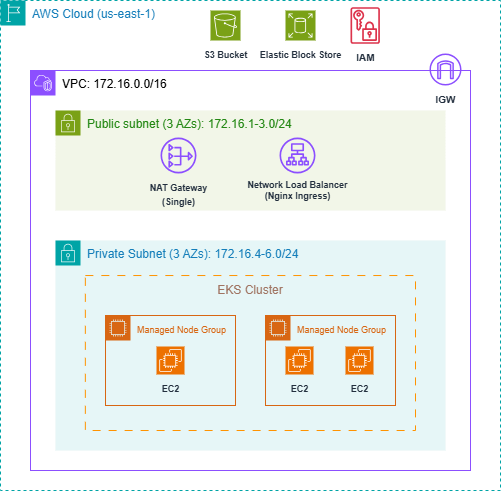
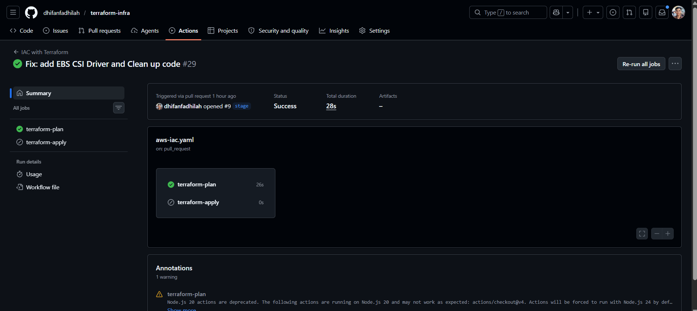
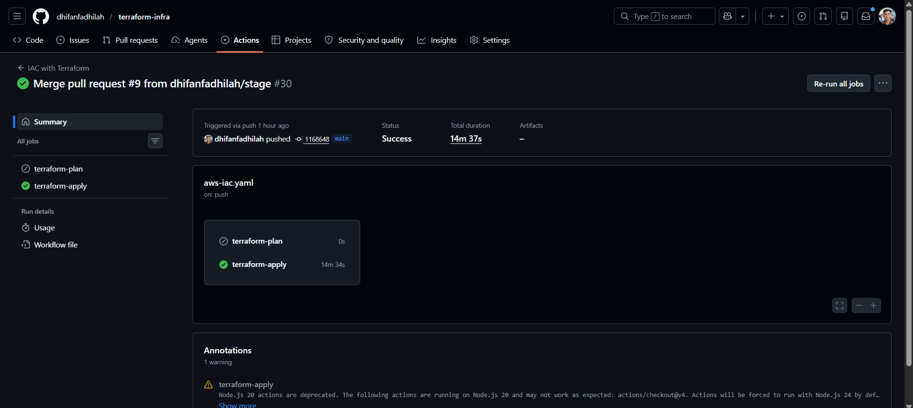
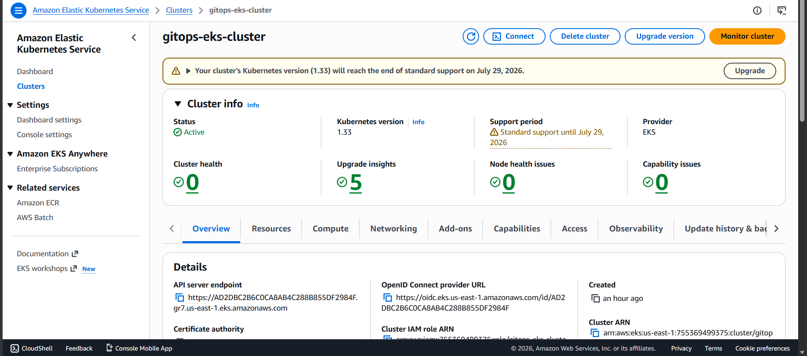
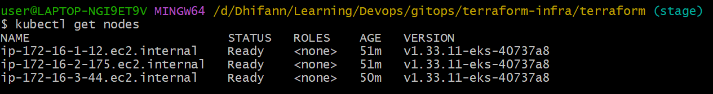

# ☁️ GitOps Infrastructure: AWS EKS & VPC Provisioning

This repository houses the **Infrastructure as Code (IaC)** required to provision a highly available, secure, and scalable Amazon EKS (Elastic Kubernetes Service) environment. The infrastructure is entirely managed via Terraform and automated through a GitOps-driven GitHub Actions CI/CD pipeline.

### 🔗 The Application Repository
> **Note:** This repository provisions the foundational AWS cloud infrastructure. To see the Dockerization, Helm charts, and the CI/CD pipeline that deploys the actual Java application onto this cluster, please visit the **[Application Repository Here](https://github.com/dhifanfadhilah/app-repo)**.

---

## 🏗️ Architecture Overview

The infrastructure provisions a production-ready networking and compute baseline:
* **VPC Networking:** A custom AWS VPC (`172.16.0.0/16`) spanning 3 Availability Zones with 3 Public and 3 Private subnets.
* **NAT Routing:** A Single NAT Gateway setup for outbound internet access from private subnets (optimizing for cost/Free-Tier limits).
* **Compute:** EKS Cluster utilizing Managed Node Groups (`t3.small` instances).
* **Traffic Routing:** NGINX Ingress Controller automatically bootstrapped via Helm, configured to provision an AWS Network Load Balancer (NLB) for internet-facing traffic.

---

## 🚀 Key Engineering Features (The Flex)

### 1. Passwordless AWS Authentication (OIDC)
This pipeline uses **OpenID Connect (OIDC)** to establish a temporary, cryptographic trust relationship between GitHub Actions and AWS.

### 2. IAM Roles for Service Accounts (IRSA)
The cluster uses IRSA to grant the **AWS EBS CSI Driver** permissions to provision persistent storage (EBS Volumes) dynamically. The pods themselves have no AWS permissions, only the specific storage controller service account holds the IAM role.

### 3. Automated GitOps Pipeline
Infrastructure changes are strictly enforced through Git events:
* **Pull Requests:** Trigger a `terraform plan` and `terraform validate`, allowing team members to review infrastructure changes before they happen.
* **Merges to `main`:** Automatically trigger a `terraform apply` to synchronize the AWS environment with the `main` branch. 
* **State Management:** Terraform state is securely locked and stored remotely in an AWS S3 Bucket.

---

## 🛠️ Challenges Overcome

During the development of this infrastructure, several challenges were resolved:

* **Storage Immutability & Unbound PVCs:** The application deployment initially failed with a `503 Gateway Error` due to unbound Persistent Volume Claims (PVCs) for the MySQL database. I resolved this by utilizing Terraform to install the AWS EBS CSI Driver and attach it to an IRSA role, enabling dynamic `gp2` storage provisioning.
* **Version Conflicts** Encountered multiple conflicts between Terraform providers and modules due to mismatched version constraints, leading to `init` and `plan` failures. I resolved this by pinning provider versions, aligning module compatibility, and restructuring the configuration to maintain consistent dependency resolution.

---

## 📸 Screenshots

### Successful Workflow

### EKS Cluster

### Kubernetes Nodes
